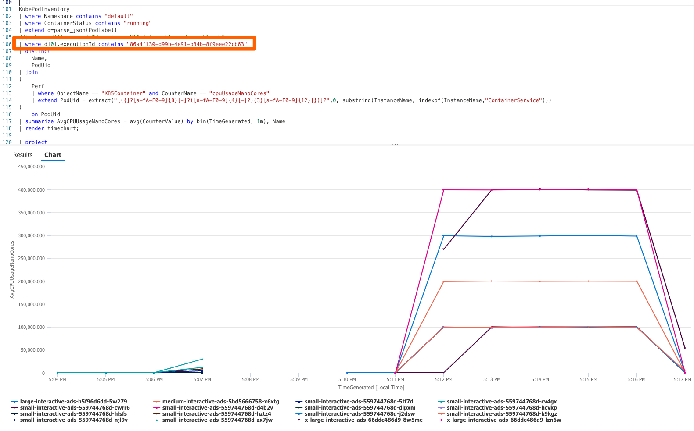

# Dynamic Label Distribution Strategy

## Dynamic Label Distribution Model Context

Litmus Chaos is an open source Chaos Engineering platform that is traditionally used to identify weaknesses and potential outages in Kubernetes applications by inducing chaos tests in a controlled way. In this strategy, however, we use Litmus Chaos as an **infrastructure stress testing tool**. This allows us to perform infrastructure scale testing through simulating resource usage, such as cpu, memory, and disk utilization.

For our strategy, we define various types of simulated workloads with their corresponding CPU and memory limits. The table below shows an example with arbitrary values:

| Workload Size | CPU | Memory |
| ------------ | ------ | ---- |
| Small    | 1000m  | 8Gi  |
| Medium   | 2000m  | 16Gi |
| Large    | 4000m  | 32Gi |
| X-Large  | 8000m  | 64Gi |
| XX-Large | 16000m | 64Gi |

This strategy, AKA the "Simulation Engine", uses Argo Workflow constructs to decouple and execute the three independent components of the scenario simulation.


The first of these components is the **App Manager**, which defines and deploys all workloads, grouping them by workload size. It knows all the specific nuances of scenario deployments, including pods characteristics such as custom images, node selectors, resource limits, etc. The AppManager template file is [here](./chaos-templates/app-manager.yaml).

The second is the **Stressors Manager**. This one is specialized in deploying the actual Litmus experiments grouped by type of experiment. For example, for the CPU experiments, it will know how to deploy all the CPU stressors, each targeting a CPU consumption target. We can have x number of CPU stressors, each covering a different CPU range (e.g. 0%-1%), where the overall range will cover the entire spectrum from 0% to 100% CPU utilization. The StressorManager template is [here](./chaos-templates/stressor-manager.yaml).

The last component is the **Distribution Manager**. As stressors target workloads/pods using basic label selectors, the distribution manager knows how to implement the distribution algorithm. In this case, it could apply the stressor label based on the given distribution in a periodic way causing the workloads to consume the expected range of resources dynamically over time. The distribution manager templates is [here](./chaos-templates/label-manager.yaml).

The demo of how simulation framework is implemented using distribution manager is available [here](./../demo/DistributionDemo.mp4)

## How To Configure a Scenario

The table below describes the main settings that need to be configured for a simulation run. They are split based on the module they represent, but all are part of the main simulation file. For an example, take a look at [small-scale-scenario.yaml](./small-scale-scenario.yaml).

### General Simulation Settings

| Key                | Description                                                                    |
| ------------------ | ------------------------------------------------------------------------------ |
| stressors_duration | How long, in seconds, each stressor's cycle will last                          |
| loop_number        | How many rounds of label distribution and stressor execution there will be     |
| app_namespace      | Namespace to deploy the Target applications/workloads                          |

### App Manager Settings


The App Manager will take the list parameter named `target_app_configs`, shown below, and concurrently deploy all the workload types. For each of these types, the instances will be deployed one by one as independent pods and sequentially set a random delay before looping to deploy the next one. This approach provides a dynamic nondeterministic behavior, as depicted in the graph above.

``` yaml
- name: target_app_configs
value: |
[
{ "size": "small", "workload_id": "small-interactive-ads", "instances": "2", "cpu_limit": "1000m", "memory_limit": "8Gi", "delay_min" : "60", "delay_max": "120", "pod_image": "nginx", "app_label": "app_label1" },

{ "size": "medium", "workload_id": "medium-interactive-ads", "instances": "2", "cpu_limit": "2000m", "memory_limit": "16Gi" , "delay_min": "60", "delay_max": "120", "pod_image": "nginx", "app_label": "app_label2" },

{ "size": "large", "workload_id": "large-interactive-ads", "instances": "2", "cpu_limit": "4000m", "memory_limit": "32Gi", "delay_min": "60", "delay_max": "120", "pod_image": "nginx" , "app_label": "app_label3" },

{ "size": "x-large", "workload_id": "x-large-interactive-ads", "instances": "2", "cpu_limit": "8000m", "memory_limit": "64Gi" , "delay_min": "60", "delay_max": "120", "pod_image": "nginx", "app_label": "app_label4" },

{ "size": "xx-large", "workload_id": "xx-large-interactive-ads", "instances": "1", "cpu_limit": "16000m", "memory_limit": "64Gi" , "delay_min": "60", "delay_max": "120", "pod_image": "nginx", "app_label": "app_label5" }
]
```

The following table provides a description for each field:

| Key          | Description                                                                          |
| ------------ | ------------------------------------------------------------------------------------ |
| size         | T-Shirt Workload size                                                                |
| workload_id  | Workload identifier - pod names will be composed out of this                         |
| instances    | Number of instances to deploy - Do not confuse with the deployment replica concept   |
| cpu_limit    | CPU limit in millicores                                                              |
| memory_limit | Memory limit (e.g. 8Gi)                                                              |
| delay_min    | Minimum amount of seconds it will wait to deploy the next instance                   |
| delay_max    | Maximum amount of seconds it will wait to deploy the next instance                   |
| pod_image    | Custom container docker image to use                                                 |
| app_label    | Custom app label —  this one will not be used for label distribution                     |

### Stressors Manager Settings


The Stressors Manager will take the list parameter `cpu_stressors` (shown below as a reference) and `mem_stressors` and concurrently deploy all the Litmus Chaos experiments based on the configuration for each type. For the CPU experiment, a set of CPU stressors, the sum of all covering the whole range between 0 to 100 CPU utilization, will be deployed, each targeting a specific label selector.

The stressors will run for the number of seconds specified in the `stressors_duration` parameter mentioned in the **General Simulation Settings**, then it resets and will immediately run again. 10 minutes is set as the example in the diagram above. This process will repeat as many times as defined in the `loop_number` parameter. As mentioned before, the goal is for the Litmus experiments to pick up all target pods labeled during the distribution manager process.

> Note - The Disk IO stressor in these examples is implemented slightly differently than CPU and memory. It does not follow the same distribution approach, but instead stresses all pods with some randomized disk spike based on an inputted range.

```YAML
- name: cpu_stressors
value: |
[
{ "cpu_load_min": "0", "cpu_load_max": "1", "target_label": "cpu_stressor=1cpu" },
{ "cpu_load_min": "1", "cpu_load_max": "2", "target_label": "cpu_stressor=2cpu" },
{ "cpu_load_min": "2", "cpu_load_max": "5", "target_label": "cpu_stressor=5cpu" },
{ "cpu_load_min": "5", "cpu_load_max": "10", "target_label": "cpu_stressor=10cpu" },
{ "cpu_load_min": "10", "cpu_load_max": "25", "target_label": "cpu_stressor=25cpu" },
{ "cpu_load_min": "25", "cpu_load_max": "50", "target_label": "cpu_stressor=50cpu" },
{ "cpu_load_min": "50", "cpu_load_max": "75", "target_label": "cpu_stressor=75cpu" },
{ "cpu_load_min": "75", "cpu_load_max": "100", "target_label": "cpu_stressor=100cpu" }
]
```

The next table provides a description for each field:

| Key          | Description                                     |
| ------------ | ----------------------------------------------- |
| cpu_load_min | Minimum CPU target load for each CPU Stressor   |
| cpu_load_max | Maximum CPU target load for each CPU Stressor   |
| target_label | Label selector used to identify pods to stress  |

### Label Distribution Manager Settings


The Distribution Manager will take the list parameters `cpu_distribution_map` (shown below as a reference) and `mem_distribution_map` and concurrently implement the distribution by applying the randomized probability on each of the pods grouped by workload type.

The Distribution Manager will always run after the stressors are reset and will re-apply the labels to all pods for all workloads again. This process will repeat as defined in the `loop_number` parameter.

``` yaml
- name: cpu_distribution_map
value: |
[
{"size": "small", "label": "cpu_stressor=1cpu", "percentage": "50"},
{"size": "small", "label": "cpu_stressor=2cpu", "percentage": "19"},
{"size": "small", "label": "cpu_stressor=5cpu", "percentage": "7"},
{"size": "small", "label": "cpu_stressor=10cpu", "percentage": "3"},
{"size": "small", "label": "cpu_stressor=25cpu", "percentage": "4"},
{"size": "small", "label": "cpu_stressor=50cpu", "percentage": "13"},
{"size": "small", "label": "cpu_stressor=75cpu", "percentage": "4"},
{"size": "medium", "label": "cpu_stressor=1cpu", "percentage": "59"},
{"size": "medium", "label": "cpu_stressor=2cpu", "percentage": "5"},
{"size": "medium", "label": "cpu_stressor=5cpu", "percentage": "5"},
{"size": "medium", "label": "cpu_stressor=10cpu", "percentage": "5"},
{"size": "medium", "label": "cpu_stressor=25cpu", "percentage": "5"},
{"size": "medium", "label": "cpu_stressor=50cpu", "percentage": "5"},
{"size": "medium", "label": "cpu_stressor=75cpu", "percentage": "11"},
{"size": "medium", "label": "cpu_stressor=100cpu", "percentage": "5"},
{"size": "large", "label": "cpu_stressor=1cpu", "percentage": "81"},
{"size": "large", "label": "cpu_stressor=2cpu", "percentage": "3"},
{"size": "large", "label": "cpu_stressor=5cpu", "percentage": "5"},
{"size": "large", "label": "cpu_stressor=10cpu", "percentage": "3"},
{"size": "large", "label": "cpu_stressor=25cpu", "percentage": "2"},
{"size": "large", "label": "cpu_stressor=50cpu", "percentage": "3"},
{"size": "large", "label": "cpu_stressor=75cpu", "percentage": "2"},
{"size": "large", "label": "cpu_stressor=100cpu", "percentage": "1"},
{"size": "x-large", "label": "cpu_stressor=1cpu", "percentage": "57"},
{"size": "x-large", "label": "cpu_stressor=2cpu", "percentage": "7"},
{"size": "x-large", "label": "cpu_stressor=5cpu", "percentage": "6"},
{"size": "x-large", "label": "cpu_stressor=10cpu", "percentage": "7"},
{"size": "x-large", "label": "cpu_stressor=25cpu", "percentage": "6"},
{"size": "x-large", "label": "cpu_stressor=50cpu", "percentage": "6"},
{"size": "x-large", "label": "cpu_stressor=75cpu", "percentage": "5"},
{"size": "x-large", "label": "cpu_stressor=100cpu", "percentage": "6"},
{"size": "xx-large", "label": "cpu_stressor=1cpu", "percentage": "86"},
{"size": "xx-large", "label": "cpu_stressor=2cpu", "percentage": "2"},
{"size": "xx-large", "label": "cpu_stressor=5cpu", "percentage": "2"},
{"size": "xx-large", "label": "cpu_stressor=10cpu", "percentage": "2"},
{"size": "xx-large", "label": "cpu_stressor=25cpu", "percentage": "2"},
{"size": "xx-large", "label": "cpu_stressor=50cpu", "percentage": "2"},
{"size": "xx-large", "label": "cpu_stressor=75cpu", "percentage": "2"},
{"size": "xx-large", "label": "cpu_stressor=100cpu", "percentage": "2"}
]
```

The following table provides a description for each field:

| Key        | Description                                                            |
| ---------- | ---------------------------------------------------------------------- |
| size       | Workload size to group by                                              |
| label      | Stressor label to be applied                                           |
| percentage | What percentage of the workloads sessions must fall into this stressor |

### Label Distribution Algorithm

At the heart of the label distribution approach is the algorithm that applies the probability for each pod, grouped by size, to achieve a specific resource consumption target (e.g. 2%-5% CPU) by applying the corresponding label matching the stressors' target pods (e.g. `cpu_stressor=5cpu`). The following code snippet shows the distribution algorithm which can be applied to CPU or Memory distribution:

``` sh
#!/bin/bash
apk add jq

# Load in distribution map
distribution='{{inputs.parameters.distribution_map}}'

# Create array of sizes from the distribution map
sizes=($(echo $distribution | jq -c '.[] | .size' | sort | uniq))

# Loop through all sizes
for size in ${sizes[@]}; do

	size_noquote=${size//\"}
	
	echo "Size $size_noquote"
	
	# Loop through all pods in the app namespace with the given size label and in "Running" state
	for pod in $(kubectl get pods -o name -l size=$size_noquote -n {{inputs.parameters.app_namespace}} --field-selector status.phase=Running); do
	
		echo "pod name $pod"
		echo "size again $size_noquote"
		
		# Create array of "percentage" values from the distribution map for this size
		probability=($(echo $distribution | jq -c '.[] | select(.size == '$size') | "\(.percentage)"'))
		
		# Create array of "label" values from the distribution map for this size
		labels=($(echo $distribution | jq -r '.[] | select(.size == '$size') | " \(.label)"'))

		# Note: the above arrays are expected to be in the same order
		
		# Apply distribution algorithm to select the appropriate labels and then apply them to the pods via kubectl
		random_number=$((RANDOM % 100))
		
		count=0
		echo "Random number: $random_number"
		index=0
		
		for i in ${probability[@]}; do
			i=${i//\"}
			echo "current probability $i"
			count=$((count + i))
			echo "counter $count"
			
			if [[ $random_number -le $count ]]; then
				echo ${labels[index]}
				kubectl label $pod ${labels[index]} -n {{inputs.parameters.app_namespace}} --overwrite
				break
			fi
			index=$((index + 1))
		done
	done
done
```

## Trigger a Scenario

The following script uses the `Litmusctl` to trigger new scenarios from a shell prompt. You can also use the Litmus UI or a pipeline to do this instead.

```bash
# port-forward the Litmus frontend service
kubectl port-forward svc/chaos-litmus-frontend-service 9091:9091

# set litmusctl credentials
litmusctl config set-account --endpoint="http://127.0.0.1:9091/" --username="admin" --password="litmus" 

# litmusctl get projects
DEFAULT_PROJECT=$(litmusctl get projects |  awk '$1  ~ /[({]?[a-fA-F0-9]{8}[-]?([a-fA-F0-9]{4}[-]?){3}[a-fA-F0-9]{12}[})]?/'  | awk '{ print $1 }' |  awk 'NR>1{exit};1')

# print the available chaos-scenarios
DELEGATE_ID=$(litmusctl get   chaos-delegates --project-id=$DEFAULT_PROJECT |  awk '$1  ~ /[({]?[a-fA-F0-9]{8}[-]?([a-fA-F0-9]{4}[-]?){3}[a-fA-F0-9]{12}[})]?/'  | awk '{ print $1 }' |  awk 'NR>1{exit};1')

# trigger the scenario
litmusctl create chaos-scenario -f {your-scenario-yaml-file} --project-id=$DEFAULT_PROJECT --chaos-delegate-id=$DELEGATE_ID
```

## Telemetry using Azure Monitor 

The following is a high-level glimpse of an Azure Monitor Kusto query that filters by the `executionID` label (see the orange rectangle in the image) and renders the average CPU consumption for each workload in a specific scenario run. Following this pattern we can add many more filters and aggregations - although there may be some caveats and limitations we don't know yet.



The kusto query:
``` sql
KubePodInventory
| where Namespace contains "default"
| where ContainerStatus contains "running"
| extend d=parse_json(PodLabel)
//| where d[0].scenarioId contains "10-interactive-ads-workloads"
| where d[0].executionId contains "86a4f130-d99b-4e91-b34b-8f9eee22cb63"
| distinct 
    Name,
    PodUid
| join
(
    Perf
    | where ObjectName == "K8SContainer" and CounterName == "cpuUsageNanoCores" 
    | extend PodUid = extract("[({]?[a-fA-F0-9]{8}[-]?([a-fA-F0-9]{4}[-]?){3}[a-fA-F0-9]{12}[})]?",0, substring(InstanceName, indexof(InstanceName,"ContainerService")))
)
    on PodUid
| summarize AvgCPUUsageNanoCores = avg(CounterValue) by bin(TimeGenerated, 1m), Name
| render timechart;
```

Same as above but grouped by workload type:
```sql
KubePodInventory
// | where Namespace contains "default"
| where ContainerStatus contains "running"
| extend d=parse_json(PodLabel)
//| where d[0].scenarioId contains "10-interactive-ads-workloads"
| where d[0].executionId contains "12345678-5c02-4f7b-a339-a2135fc60d69"
| distinct 
    Name,
    workloadType = tostring(d[0].workloadId),
    PodUid
| join
(
    Perf
    | where ObjectName == "K8SContainer" and CounterName == "cpuUsageNanoCores" 
    | extend PodUid = extract("[({]?[a-fA-F0-9]{8}[-]?([a-fA-F0-9]{4}[-]?){3}[a-fA-F0-9]{12}[})]?",0, substring(InstanceName, indexof(InstanceName,"ContainerService")))
)
    on PodUid
| summarize AvgCPUUsageNanoCores = avg(CounterValue) by bin(TimeGenerated, 1m), workloadType
| render timechart;

```

Just by changing the CounterName on the Perf table, you can query by any other performance metric (that applies to K9sContainer objects)

``` sql
KubePodInventory
| where Namespace == "default"
| extend labels = parse_json(PodLabel)
| where labels[0].executionId contains "86a4f130-d99b-4e91-b34b-8f9eee22cb63"
| distinct
    Name,
    PodUid
| join
(
    Perf
    | where ObjectName == "K8SContainer" and CounterName == "memoryWorkingSetBytes"
    | extend PodUid = extract("[({]?[a-fA-F0-9]{8}[-]?([a-fA-F0-9]{4}[-]?){3}[a-fA-F0-9]{12}[})]?",0, substring(InstanceName, indexof(InstanceName,"ContainerService")))
)
 on PodUid
 | summarize AvgrmemoryWorkingSetBytes = avg(CounterValue) by bin(TimeGenerated, 1m), Name
 | render timechart
 ```

A basic aggregation by any label can be done following the below example

``` sql
KubePodInventory
| where Namespace == "default"
| where ContainerStatus == "running"
| extend d=parse_json(PodLabel)
| where d[0].scenarioId == "10-interactive-ads-workloads"
| summarize dcount(Name) by tostring(d[0].workloadId)
```

Other available labels we added to the target apps include:

* `app`
* `executionId`
* `scenarioId`
* `size`
* `workloadId`

## Main learnings from spike distribution approach

We have tested this spike approach a few times with an emphasis on setting up 12-hour CPU and Memory simulations, and here is the summary of our first observations, including various assumptions around how experiments and target labels behave:
* The Litmus experiments don't update target pods dynamically in real time. The CPU and Memory stressors only select the target pods as soon as the stressors get started based on the label selectors. This behavior means we needed to implement a strategy that constantly resets all stressors every time we apply the label distribution algorithm to have them take the new and re-labeled pods.
* We validated our assumption that a single Litmus experiment targeting a CPU or Memory consumption range can target multiple pods simultaneously. That means a CPU stressor for 50% can apply 50% cpu stress on multiple target pods.
* We validated our assumption that a single target-pod can be targeted/stressed by different Litmus experiments. We could confirm this using CPU and Memory experiments to target the same target pod successfully. Our experiments shows that the CPU stressor and the Memory stressor are applied at the same time on the same target pod.
* We successfully used an Argo Workflow step that executes a Linux image with kubectl pre-installed. At execution time, the Linux image gets spun up, and a shell script runs a series of commands that implements the distribution algorithm. Tentatively, multiple distribution algorithms can be implemented, which may help test different approaches to how the labels are distributed. The distribution algorithm is encapsulated in a template file. Hence we can have different template files with different algorithms if needed.
* Experiments fail if no target pods are available. Even if only one experiment fails, Litmus considers the whole simulation failed. This behavior is a significant finding as the overall status from a Litmus scenario run can not be regarded as the ultimate final state for the actual simulation. Making direct calls to the Litmus GraphQL API proved a valid alternative to verify a simulation is still running even if its overall status is marked as failed. We specifically check on whether at least one step in the workflow is still running.
* Minimal real-time troubleshooting functionality is available when using the Litmus UI or the Litmus CLI tool. The Litmus UI is useless when the rendered tree gets too big and becomes unresponsive.

* Another key learning was regarding getting help from the community. Usually, Litmus maintainers are very responsive on the Kubernetes/Litmus Slack channel, where we establish ongoing communication to solve issues, resolve doubts and get help. We also contributed back, pushing PRs that fixed critical bugs. You can find some of these fixes being released on the litmusctl 0.16.0 version here https://github.com/litmuschaos/litmusctl/releases/tag/0.16.0
* You can trigger the scenarios using Argo Workflows CLI for better traceability on YAML errors. Litmus won't spell out any hint on what type of YAML configuration error you have on the scenario.

This is how a 12-hour simulation looks with 30 pods from different sizes, resetting labels every 20 minutes and applying a very basic evenly distributed random algorithm. On the first few hours it was slowly provisioning new pods.


