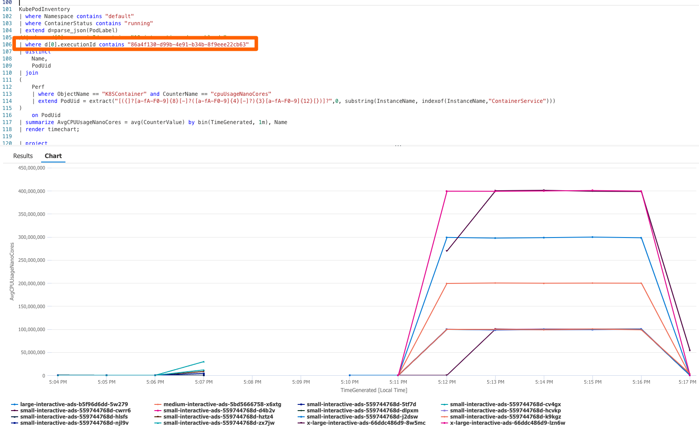

The following is a high level glimpse of an Az monitor Kusto query that filters by one the new Label we added to the target apps deployment called executionID (see the orange rectangle) and renders the average cpu consumption grouped by each of the containers of a specific scenario run. Following this pattern we can get many more filters and aggregations - although they may be some caveats and limitations we don't know yet.





The kusto query:
``` sql
KubePodInventory
| where Namespace contains "default"
| where ContainerStatus contains "running"
| extend d=parse_json(PodLabel)
//| where d[0].scenarioId contains "10-interactive-ads-workloads"
| where d[0].executionId contains "86a4f130-d99b-4e91-b34b-8f9eee22cb63"
| distinct 
    Name,
    PodUid
| join
(
    Perf
    | where ObjectName == "K8SContainer" and CounterName == "cpuUsageNanoCores" 
    | extend PodUid = extract("[({]?[a-fA-F0-9]{8}[-]?([a-fA-F0-9]{4}[-]?){3}[a-fA-F0-9]{12}[})]?",0, substring(InstanceName, indexof(InstanceName,"ContainerService")))
)
    on PodUid
| summarize AvgCPUUsageNanoCores = avg(CounterValue) by bin(TimeGenerated, 1m), Name
| render timechart;
```

Same as above but grouped by workload type
```sql
KubePodInventory
// | where Namespace contains "default"
| where ContainerStatus contains "running"
| extend d=parse_json(PodLabel)
//| where d[0].scenarioId contains "10-interactive-ads-workloads"
| where d[0].executionId contains "12345678-5c02-4f7b-a339-a2135fc60d69"
| distinct 
    Name,
    workloadType = tostring(d[0].workloadId),
    PodUid
| join
(
    Perf
    | where ObjectName == "K8SContainer" and CounterName == "cpuUsageNanoCores" 
    | extend PodUid = extract("[({]?[a-fA-F0-9]{8}[-]?([a-fA-F0-9]{4}[-]?){3}[a-fA-F0-9]{12}[})]?",0, substring(InstanceName, indexof(InstanceName,"ContainerService")))
)
    on PodUid
| summarize AvgCPUUsageNanoCores = avg(CounterValue) by bin(TimeGenerated, 1m), workloadType
| render timechart;

```

Just by changing the CounterName on the Perf table, you can query by any other performance metric (that applies to K9sContainer objects)

``` sql
KubePodInventory
| where Namespace == "default"
| extend labels = parse_json(PodLabel)
| where labels[0].executionId contains "86a4f130-d99b-4e91-b34b-8f9eee22cb63"
| distinct 
    Name,
    PodUid
| join 
(
    Perf
    | where ObjectName == "K8SContainer" and CounterName == "memoryWorkingSetBytes" 
    | extend PodUid = extract("[({]?[a-fA-F0-9]{8}[-]?([a-fA-F0-9]{4}[-]?){3}[a-fA-F0-9]{12}[})]?",0, substring(InstanceName, indexof(InstanceName,"ContainerService")))
)
 on PodUid
 | summarize AvgrmemoryWorkingSetBytes = avg(CounterValue) by bin(TimeGenerated, 1m), Name
 | render timechart 
 ```

A basic aggregation by any label can be done following the next standard
``` sql
KubePodInventory
| where Namespace == "default"
| where ContainerStatus == "running"
| extend d=parse_json(PodLabel)
| where d[0].scenarioId == "10-interactive-ads-workloads"
| summarize dcount(Name) by tostring(d[0].workloadId)
```

Other available Labels we added to the target apps include:
* app
* executionId
* scenarioId
* size
* workloadId